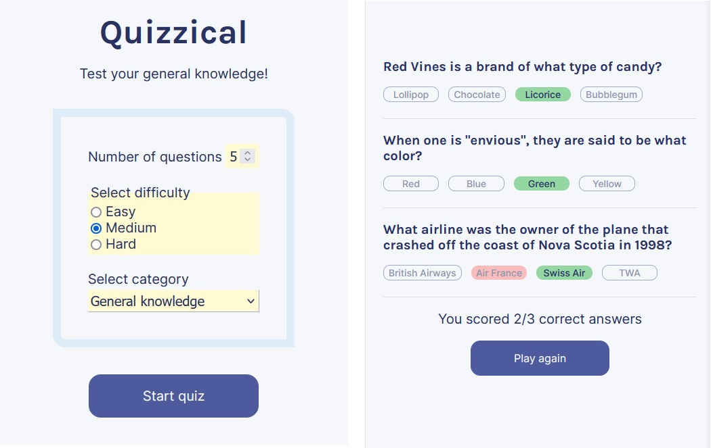

# Quizzical

A quiz app that allows user to select category, level of difficulty and number of questions.

## Table of contents

- [Overview](#overview)
  - [Features](#features)
  - [Screenshot](#screenshot)
  - [Links](#links)
- [My process](#my-process)
  - [Built with](#built-with)
  - [What I learned](#what-i-learned)
  - [Continued development](#continued-development)
- [Author](#author)
- [Acknowledgments](#acknowledgments)


## Overview

### Features


- Qustions are pulled from API
- User can select answers
- App highlights incorrect answers
- App displays a final score
- Fully responsive design


### Screenshot




### Links

- Code: [Github](https://github.com/Arniss5/quizzical)
- Live Site URL: [Github Pages](https://arniss5.github.io/quizzical/)

## My process

### Built with

- HTML5
- CSS
- React
- API


### What I learned

This project allowed me to practice many aspect of React: creating JSX and custom components, using props, event listeners, mapping data, handling state and side effects, conditional rendering and designing forms. It was also a good exercise on pulling data from API and creating responsive design with CSS. 

```js
const [quizData, setQuizData] = React.useState([])
    const [gameComplete, setGameComplete] = React.useState(false)
```
```js
React.useEffect(() => {
         //Stop effect from running twice
        if (dataFetchedRef.current) return;
        dataFetchedRef.current = true;
        fetch(`https://opentdb.com/api.php?amount=${props.formData.number}&category=${props.formData.category}&difficulty=${props.formData.difficulty}&type=multiple`)
            .then(res => res.json())
            .then(data => {
                    setQuizData(getQuizItems(data.results))
            })       
    }, [clicks])
```
```js
 return (<button 
             key={nanoid()}
             data-id={props.elId}
             className={["answer", colorStyling].join(" ")}
             onClick={event => props.selectAnswer(event)}
             value={answer}
         >
             {he.decode(answer)}
        </button>)
```


### Continued development

I'm learning more advanced react concepts such as: class components, re-usability (higher order components, render props), performance, hooks and React Router.

## Author

- Github - [Arniss5](https://github.com/Arniss5)


## Acknowledgments

[Quiz API](https://opentdb.com//)